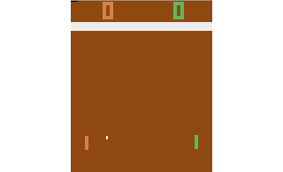

# Reinforcement Learning for Atari Using PyTorch

I have recently been playing around with reinforcement learning, training agents to play Atari games like Pong. The agent observes the environment using only the pixels on the screen, similar to the way a human player would observe the game, and takes actions, which are button presses. The agent also receives rewards; for Pong, the reward is +1 when the agent scores a point, and -1 when the opponent scores a point.

Initially, the agent moves randomly, and loses almost every time. But occasionally, that random movement hits the ball, which either delays the negative reward, or even scores a point, for a positive reward, which reinforces the preceding actions.

This poses some interesting challenges: the rewards are intermittent, and often come long after the relevant actions. For example, if the agent hits the ball in a good direction, where the opponent cannot respond, it will not receive a reward until many frames later, after taking many other actions.

This was implemented in Python, using [OpenAI Gym](https://github.com/openai/gym) to simulate the Atari and handle the observations, actions and rewards of the agent. The agent architecture is based on the [Asynchronous Advantage Actor-Critic (A3C)](https://arxiv.org/pdf/1602.01783.pdf) training algorithm, a state of the art algorithm for reinforcement learning. It uses a deep neural network, which is trained on two different outputs: the actor--a probability distribution, from which the next action is sampled--and a critic--an estimation of future reward. An accurate critic allows the performance of the actor to be more accurately scored after a short interval of time--perhaps we have not yet scored a point, but the critic can predict that we will score soon. Both of these values use the same underlying neural network, with different final layers--this helpful for training, because features useful for the actor are also likely to be useful for the critic, and vice-versa.

I decided to use [PyTorch](http://pytorch.org) instead of [TensorFlow](http://tensorflow.org) for this project. TensorFlow is great for the sort of static neural networks used for things like image categorization, but the time dimension makes this problem more dynamic, which PyTorch handles elegantly.
